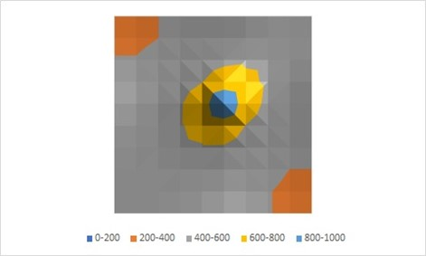

# Heat Diffusion Simulation

## Overview
This project implements a simulation of heat diffusion in a plate using the heat conduction equation. The temperature of the plate starts at 20°C, with a heat source at 1000°C located at the center of the plate. The plate is divided into two materials with different thermal conductivities, arranged in a checkerboard pattern. The thermal conductivities used are 0.0000687 and 0.0000019.

## Results
The simulation results for the plate with materials of different thermal conductivities are shown below:

1. **Heat Diffusion Visualization:**  
   In this visualization, the heat source is located at the center of the plate. The material with lower thermal conductivity heats up less than 400°C within the chosen time frame, while the material with higher thermal conductivity exhibits a more pronounced heating effect, including around the heat source, creating a "symmetric" heating pattern.

   

## Code Structure
- **main()**: Initializes the temperature grid and performs the heat diffusion calculations using the explicit method. It updates the temperature grid iteratively and outputs the final temperature distribution to a file.
- **File Output**: Saves the resulting temperature distribution to `file.txt`.

## Dependencies
- **C++ Standard Library**: Used for basic input/output and mathematical operations.
- **fstream**: For file operations.

